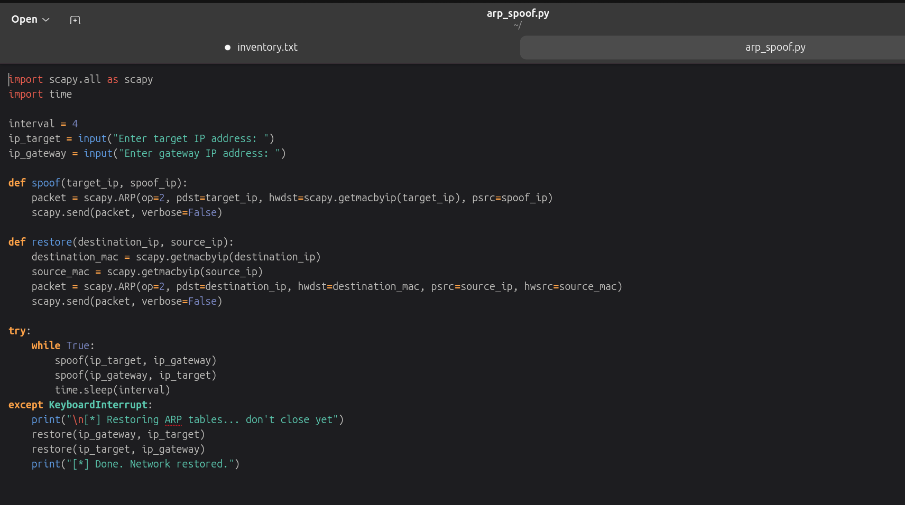
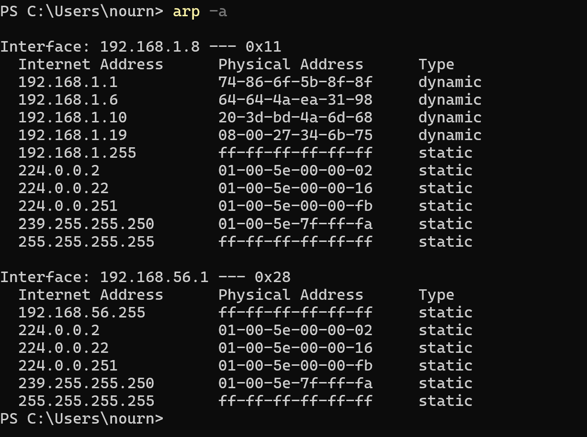
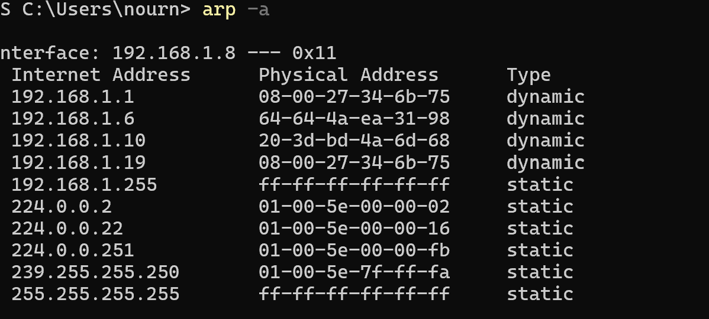
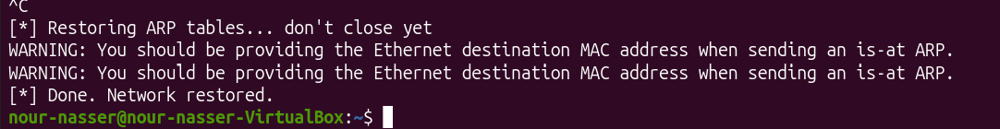
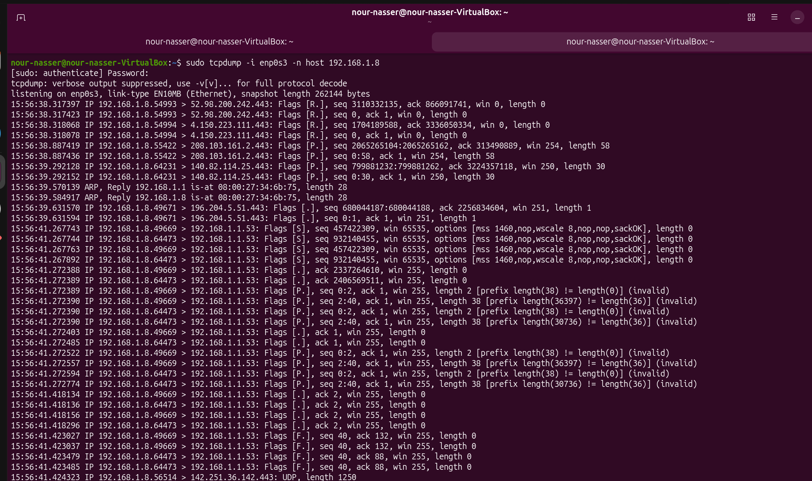
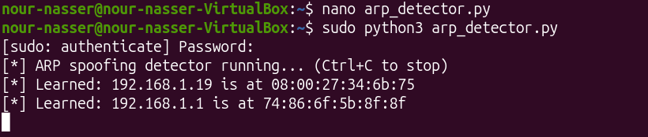
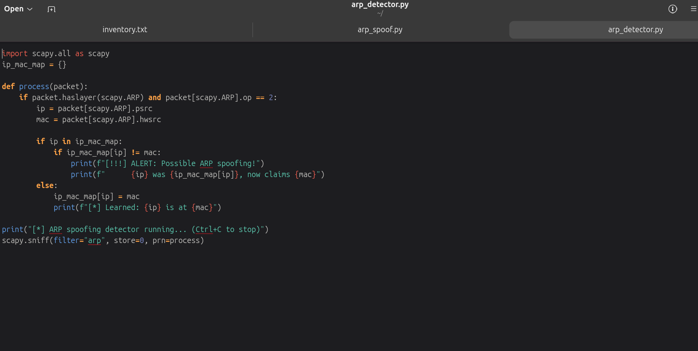
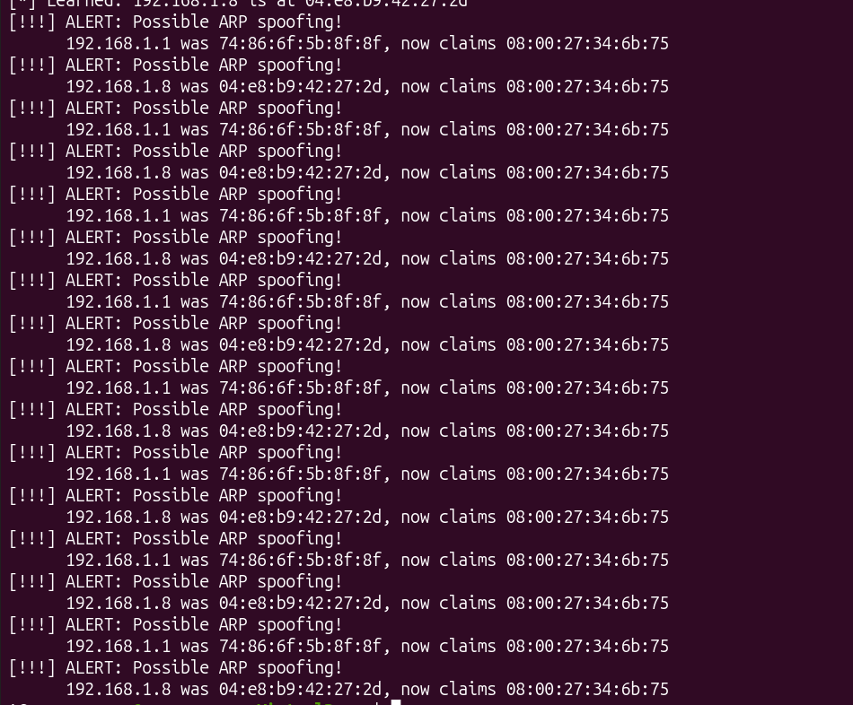

# ARP Spoofing Detector

A Python/Scapy tool that detects ARP spoofing (a common Man-in-the-Middle technique) in real time — built alongside a small ARP spoofing *attack* script that I wrote first, purely to understand how the attack actually works before trying to catch it.

## Why I built this

This started as a side effect of an earlier project — a home network baseline + Suricata IDS setup, where I noticed some odd ARP behavior on my network while reviewing traffic. I didn't fully understand *why* it was suspicious at the time, so I decided to go build the attack myself in a lab, see exactly what it looks like from both sides, and then write a detector that would have caught it. This repo is that follow-up: `arp_spoof.py` (the attack, for understanding) and `arp_detector.py` (the defense, the actual point).

Everything below was run entirely on my own home lab — my own router, my own laptop, and an Ubuntu VM I control. No other networks or devices were touched.

---

## How ARP poisoning actually works

ARP (Address Resolution Protocol) is how devices on a local network find each other's MAC (hardware) address given an IP address. The problem: **ARP has no authentication.** Any device can send out an ARP reply saying "I am 192.168.1.1" and every other device on the network will just believe it and update their ARP table accordingly — no proof required.

An attacker abuses this by sending forged ARP replies to two targets at once (usually a victim device and the router):
- To the **victim**, the attacker claims to *be* the router.
- To the **router**, the attacker claims to *be* the victim.

Now traffic that should flow `victim ↔ router` instead flows `victim ↔ attacker ↔ router`. The attacker sits in the middle of the conversation — hence "Man-in-the-Middle" (MITM).

---

## The attack tool: `arp_spoof.py`

This script does exactly the above, continuously, so the poisoning doesn't expire:

```python
packet = scapy.ARP(op=2, pdst=target_ip, hwdst=scapy.getmacbyip(target_ip), psrc=spoof_ip)
scapy.send(packet, verbose=False)
```

In plain English:
- `scapy.ARP(op=2, ...)` builds an ARP **reply** packet (`op=2` means "reply," as opposed to `op=1` which is a "request"). Nobody asked for this reply — that's the whole trick.
- `pdst=target_ip` / `hwdst=...` says *who* receives the packet (the target's IP and real MAC).
- `psrc=spoof_ip` is the lie: "the sender of this reply is `spoof_ip`" — even though it's actually coming from the attacker.
- The script calls this function on a loop (`while True: ... time.sleep(interval)`) in both directions — poisoning the target *and* the gateway — because ARP entries expire after a while, so the lie has to be repeated to stick.

For traffic to actually flow through the attacker's machine (rather than just being dropped), IP forwarding needs to be enabled on the attacker's OS — this is what makes it a *true* MITM rather than just a denial-of-service. The victim keeps their internet connection the whole time; they just don't realize their traffic is now taking a detour through me.

**Cleanup matters.** If you just kill the poisoning, both devices are left with corrupted ARP tables until the entries eventually time out on their own — which can look like a network fault. So the script catches `Ctrl+C` and sends *correct* ARP replies to restore the real mappings before exiting:

```python
def restore(destination_ip, source_ip):
    destination_mac = scapy.getmacbyip(destination_ip)
    source_mac = scapy.getmacbyip(source_ip)
    packet = scapy.ARP(op=2, pdst=destination_ip, hwdst=destination_mac, psrc=source_ip, hwsrc=source_mac)
    scapy.send(packet, verbose=False)
```

This sends the truth back to both sides — "the real MAC for X is actually Y" — undoing the poison.



---

## Running it in the lab

**Topology:**
| Role | Device | IP | MAC |
|---|---|---|---|
| Attacker | Ubuntu VM (VirtualBox, bridged networking) | `192.168.1.19` | `08:00:27:34:6b:75` |
| Victim | Windows laptop | `192.168.1.8` | `04:e8:b9:...` (partially redacted) |
| Gateway | Home router | `192.168.1.1` | `74:86:6f:5b:8f:8f` |

First, the victim's ARP table in its clean state — the router's real MAC is `74-86-6f-5b-8f-8f`:



After launching `arp_spoof.py`, the victim's table changes — the router's IP (`192.168.1.1`) now points to `08-00-27-34-6b-75`, which is my Ubuntu VM, not the actual router. That's the poison landing:



When I hit `Ctrl+C` on the attack, the restore function runs and sends the correct mappings back out:



*(The "You should be providing the Ethernet destination MAC address" warnings are Scapy being cautious about broadcast-style ARP sends — harmless here, just a style nag, not an error.)*

---

## What I could — and couldn't — see

With the victim's traffic now routing through my machine, I ran `tcpdump` to watch it live:

```
sudo tcpdump -i enp0s3 -n host 192.168.1.8
```

- `-i enp0s3` — capture on this specific network interface.
- `-n` — don't resolve IPs to hostnames (keeps output fast and readable).
- `host 192.168.1.8` — only show traffic to/from the victim's IP.



What this actually got me: source/destination IPs, ports, TCP flags, and DNS lookups — enough to see *what sites* the victim was talking to and roughly what kind of traffic it was. What it did **not** get me: any actual content — page text, credentials, messages. That's because almost all of that traffic is HTTPS/TLS-encrypted, so the payload itself is unreadable garbage without the private key. ARP poisoning gets you a front-row seat to *metadata*, not to *content* — TLS is doing exactly what it's supposed to do here.

---

## The detector: `arp_detector.py`

This is the actual deliverable. Instead of attacking, it passively watches ARP traffic and remembers who "should" own each IP:

```python
scapy.sniff(filter="arp", store=0, prn=process)
```
- `filter="arp"` — only look at ARP packets, ignore everything else.
- `store=0` — don't keep packets in memory, just process and discard (keeps it lightweight for something meant to run continuously).
- `prn=process` — run the `process()` function on every packet that matches.

```python
if packet.haslayer(scapy.ARP) and packet[scapy.ARP].op == 2:
    ip = packet[scapy.ARP].psrc
    mac = packet[scapy.ARP].hwsrc
    if ip in ip_mac_map:
        if ip_mac_map[ip] != mac:
            print(f"[!!!] ALERT: Possible ARP spoofing!")
```

In plain English: for every ARP *reply* (`op == 2`) seen on the wire, it notes "IP X claims to be at MAC Y." The first time it sees an IP, it just learns it — that's the trusted baseline. If that same IP later shows up claiming a *different* MAC, that's exactly the signature of ARP poisoning (or, rarely, a legitimate device change/DHCP re-lease — worth knowing as a caveat), so it alerts immediately.

Running it fresh, it quietly learns the legitimate mappings on the network:





---

## Validating it: attacking my own detector

To prove the detector actually works, I ran `arp_spoof.py` against the network while `arp_detector.py` was listening — same target and gateway as before:


The detector immediately started firing, catching **both directions** of the poisoning — the gateway (`.1`) suddenly "claiming" the attacker's MAC, and the victim (`.8`) doing the same:



This is the result I was after: a tool that would have flagged, in real time, the exact attack I built above — the same category of anomaly that sent me down this path in the first place.

---

## Summary

- ARP has no authentication, so anyone on the local network can forge replies and redirect traffic — that's the entire attack surface.
- I built the attack (`arp_spoof.py`) first, purely to understand the mechanics, and confirmed it worked by watching the victim's ARP table get poisoned and by capturing its traffic mid-MITM.
- TLS meant the intercepted traffic was readable at the metadata level only — a good reminder of why encryption matters even on a compromised network path.
- I then built the detector (`arp_detector.py`), which learns trusted IP-to-MAC pairs and flags any IP that changes MAC afterward.
- I validated the detector by attacking it directly and confirmed it caught the poisoning of both the victim and the gateway in real time.

## Notes on the screenshots

Raw packet captures (`.pcap` files) are intentionally **not** included in this repo — they contain live traffic from my personal home network and aren't something I want to publish, even in a lab writeup. Screenshots of terminal output are included instead. Some MAC addresses are partially redacted for the same reason.

## Disclaimer

This was run exclusively against devices I own, on my own home network, for educational purposes. ARP spoofing on a network you don't own or have explicit permission to test is illegal in most jurisdictions.
